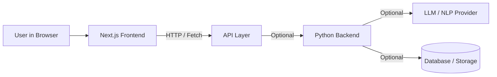

# MeetAssistant

MeetAssistant is a web app scaffold for a “meeting assistant” experience: a modern UI where you can build features like meeting notes, agendas, action items, and (optionally) AI-powered summaries.

> Status: early-stage / scaffold. The repo includes a Next.js frontend and a `Backend/` folder (Python) for server-side logic.

---

## What this solves

Teams often leave meetings with:

* scattered notes
* unclear decisions
* missing action items
* no consistent summary format

MeetAssistant is designed to centralize that flow:

1. Capture structured notes during (or after) a meeting
2. Convert notes/transcripts into a consistent “minutes” format
3. Track action items (owner + due date)
4. Optionally call an AI backend to produce summaries and insights

---

## Architecture

### High-level view



**Frontend (Next.js)**

* Owns the UI/UX: pages, components, forms, and client interactions.
* Keeps UI logic clean by moving reusable behavior into `hooks/` and shared helpers into `lib/`.

**API Layer**
You have two common options:

* **Option A (recommended for simplicity):** Next.js Route Handlers (API endpoints inside the Next app)
* **Option B (recommended for scaling):** a separate Python backend service, called by the frontend

**Backend (Python, optional)**

* Where heavier processing usually lives: transcription handling, summarization, integrations, storage, background jobs.
* This is also the right place to store secrets safely (LLM keys, OAuth tokens, etc).

---

### Suggested backend responsibilities (clean separation)

**Frontend should do**

* UI rendering
* Form validation UX (with server validation backup)
* calling APIs
* showing results (minutes, tasks, summaries)

**Backend should do**

* transcript cleaning + formatting
* summary generation + action item extraction
* persistence (DB)
* auth + permissions
* integrations (Google Calendar, Meet, Zoom, etc)

---

## Tech Stack

### Frontend

* Next.js (App Router)
* React
* TypeScript
* Tailwind CSS
* shadcn/ui + Radix UI components
* React Hook Form + Zod validation

### Backend (optional)

* Python service (inside `Backend/`)

---

## Project Structure (top level)

```txt
.
├─ app/                # Next.js routes (App Router)
├─ components/         # UI building blocks (shared components)
├─ hooks/              # Custom React hooks
├─ lib/                # Utilities, helpers, shared logic
├─ public/             # Static assets
├─ styles/             # Styling assets (if used alongside app/globals.css)
├─ Backend/            # Python backend (optional service)
└─ .next/              # Build output (should usually NOT be committed)
```

---

## Getting Started (Frontend)

### Prerequisites

* Node.js (LTS recommended)
* npm or pnpm

### Install

```bash
npm install
# or
pnpm install
```

### Run in dev mode

```bash
npm run dev
# or
pnpm dev
```

Then open: `http://localhost:3000`

### Build and start (production)

```bash
npm run build
npm run start
```

---

## Environment Variables

Create a `.env.local` file at the project root (Next.js convention). Example:

```bash
# If you run a separate backend service:
NEXT_PUBLIC_API_BASE_URL=http://localhost:8000
```

Notes:

* Variables prefixed with `NEXT_PUBLIC_` are exposed to the browser.
* Secrets (LLM keys, OAuth client secrets) should live only on the backend.

---

## Suggested API Contract (if you build the AI backend)

A clean, minimal contract that works well for meeting assistants.

### `POST /summarize`

Input:

```json
{
  "title": "Weekly Sync",
  "transcript": "raw transcript text here",
  "participants": ["A", "B"],
  "date": "2026-01-03"
}
```

Output:

```json
{
  "summary": "Short narrative summary...",
  "decisions": ["Decision 1", "Decision 2"],
  "action_items": [
    { "task": "Do X", "owner": "A", "due_date": "2026-01-10" }
  ],
  "tags": ["product", "planning"]
}
```

This keeps your frontend simple: it only sends text and renders structured results.

---

## Deployment

### Frontend (easy path)

* Deploy on Vercel (recommended for Next.js)

### Backend (if used)

* Deploy separately (Docker, Fly.io, Render, Railway, VPS, etc)
* Make sure CORS is configured to allow the frontend domain

---

## Repository Hygiene (recommended)

* The `.next/` folder is a build artifact and is typically excluded from git.
* Update `.gitignore` to include `.next/`, `dist/`, `.env*`, etc.

Example:

```gitignore
node_modules/
.next/
.env*
dist/
```

---

## Contributing

1. Fork the repo
2. Create a feature branch: `git checkout -b feature/my-change`
3. Commit changes: `git commit -m "Add: my change"`
4. Push: `git push origin feature/my-change`
5. Open a Pull Request

---

## License

Licensed under the MIT License. See the LICENSE file for details.
